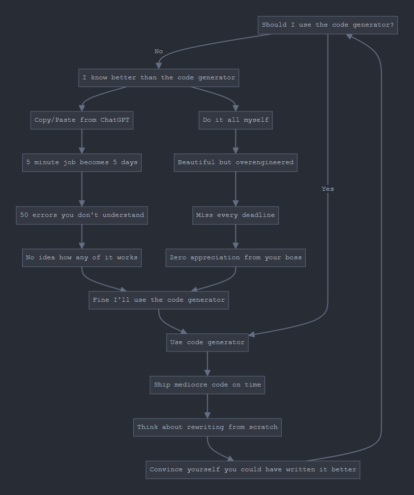

# Cynthia

A code synthesis command line tool that brings structure to AI-powered development. The CLI command is `cyn` (pronounced "sin" /sɪn/).

## Table of Contents

- [Roadmap](#roadmap)
- [Why?](#why)
- [How do generations work?](#how-do-generations-work)
- [Configuration](#configuration)
- [Personalization](#personalization)
- [Installation](#installation)
- [FAQ](#faq)
- [Warning from the Author](#warning-from-the-author)

## Roadmap

- [ ] Benchmarks and performance thresholds
- [ ] Add more models + DeepSeek R1 by default (Use Unified AI SDK)
- [ ] Cucumber/Gherkin support
- [ ] Prompt user to generate initial tests using LLM
- [ ] Add a journal feature similar to drizzle-journal (status, history, rollbacks)

## Why?

If you're going to use AI to write code, you should at least do it in a structured, testable way.

Using Cynthia is like writing unit tests first, then letting AI implement the solution. Your "tests" both specify exactly what you want and automatically verify that the generated code works correctly.

## How do generations work?

Just like database migrations!

1. Initialize your project:

```sh
cyn init
```

This creates a `cynthia.config.ts` file with default settings and a `.cynthia` directory.

1. Create a `.cyn.ts` file:

```sh
cyn create apple-bottom-jeans
```

This creates `apple-bottom-jeans.cyn.ts` in the CWD with a starter template.

1. Write your synthetic function using BDD-style tests.

What does this function do? No idea! That's Cynthia's job to figure out.*

```ts
import { createTestSuites, runTestSuites } from 'cynthia'
import testFn from './hello-world.ts' // This will be generated for you later, you still need to import it though

const t = createTestSuites()

t.describe('Fruit Tests', () => {
  t.it('should identify an apple as a fruit', () => {
    const input = ['apple']
    t.expect(input).toBe('fruit')
  })

  t.it('should not identify a carrot as a fruit', () => {
    const input = ['carrot']
    t.expect(input).not.toBe('fruit')
  })

  t.it('should match fruit object properties', () => {
    const input = { name: 'apple', type: 'fruit', color: 'red' }
    t.expect(input).toMatchObject({
      type: 'fruit',
      color: 'red',
    })
  })

  t.it('should not match vegetable object properties', () => {
    const input = { name: 'apple', type: 'fruit', color: 'red' }
    t.expect(input).not.toMatchObject({
      type: 'vegetable',
      color: 'orange',
    })
  })
})

runTestSuites(t.getState(), testFn)

export default t.getState()
```

1. Generate your synthetic function.

Ensure that you have your `OPENAI_API_KEY` in your environment:

```bash
export OPENAI_API_KEY="your-api-key-here"
```

Get your API key from [OpenAI's platform](https://platform.openai.com/api-keys). The default model is `gpt-4o-mini` but this can be configured (see [Configuration](#configuration) section).

```sh
cyn gen apple-bottom-jeans.cyn.ts
```

Wait while your function is generated and tested. On success, you'll get:

- `apple-bottom-jeans.ts` next to your `.cyn.ts` file
- `1738397981482-apple-bottom-jeans.gen.ts` in your `.cynthia` directory
- `1738397981482-apple-bottom-jeans.prompt.txt` in your `.cynthia` directory

The `.gen.ts` file contains the LLM output while the `.ts` file is just an export of the `.gen.ts` file's default export, allowing easy rollbacks when you forget test cases or the LLM gets creative. The `.prompt.txt` file contains the exact
prompt sent to the LLM for debugging purposes.

1. Use your generated code:

```ts
import appleBottomJeans from './apple-bottom-jeans.ts'

console.log(appleBottomJeans(['apple']))
// => 'fruit'
```

## Configuration

Cynthia can be configured using a `cynthia.config.ts` file in your project root.

### Configuration Options

#### OpenAI Settings

- `model`: OpenAI model to use (default: 'gpt-4o-mini')
- `temperature`: Controls randomness (0.0-2.0, default: 0)
- `maxTokens`: Optional token limit for responses
- `seed`: Seed for deterministic responses (default: timestamp, override for reproducibility)

#### Generation Settings

- `maxRetries`: Number of agentic retries when tests fail (default: 3)

#### Testing Settings

- `runTestsAfterGeneration`: Automatically run tests after generation (default: true)

#### CLI Settings

- `confirmGenerations`: Prompt for confirmation before generating (default: false)

## Personalization

Customize code generation with personalized instructions.

### Setup

```sh
mkdir -p .vscode/instructions
touch .vscode/instructions/cynthia.instructions.md
```

Add instructions, one per line:

```
Use functional programming patterns
Use descriptive variable names
Prefer map, filter, reduce over loops
Use type guards for runtime checks
Use switch for multiple conditions
```

### Behavior

Cynthia searches for `.vscode/instructions/cynthia.instructions.md` by walking up the directory tree from the current working directory. Instructions are added to the code generation prompt. Works from any subdirectory.

## Installation

### Option 1: Global Installation (Recommended)

Install Cynthia globally using Deno:

```bash
# Install from JSR (when published)
deno install --global --allow-all jsr:cynthia

# Or install from source
deno task install
```

### Option 2: Local Development

Clone the repository and install locally:

```bash
git clone https://github.com/youruser/cynthia.git
cd cynthia
deno task install
```

### Option 3: Add as Library Dependency

Use Cynthia's core functions in your project:

```bash
# Add to Deno project
deno add jsr:cynthia

# Add to Node.js project
npm install cynthia
```

## FAQ

### Help! I can't get my tests to pass!

That's the point! Cynthia uses an agentic retry system - it will automatically try multiple times to generate code that satisfies your tests. If it can't, you might need to refine your test cases or break down complex requirements into
smaller, clearer tests.

### What if I write an impossible test?

Cynthia will attempt to solve it multiple times before giving up gracefully. The system is designed to handle edge cases and provide clear feedback about what went wrong.

### How to contribute

We welcome contributions! The project is actively evolving with clear architecture for extending functionality.

### How do I know if Cynthia is right for me?



### Should I actually use this?

Cynthia provides a structured approach to AI-assisted development. It's particularly useful for:

- Rapid prototyping with clear requirements
- Test-driven development workflows
- Projects where you want AI assistance but with proper guardrails

## Important Considerations

While AI-assisted development can be incredibly productive, it's important to understand what you're building. Cynthia encourages good practices by requiring you to write comprehensive tests first, but you should still:

- Understand the problem you're trying to solve
- Review and understand the generated code
- Add additional test cases as you discover edge cases
- Use this as a tool to enhance your development workflow, not replace your understanding

Cynthia aims to bring structure and testing discipline to AI-powered development. By requiring test-first development, you'll end up with better specifications and more reliable code.
